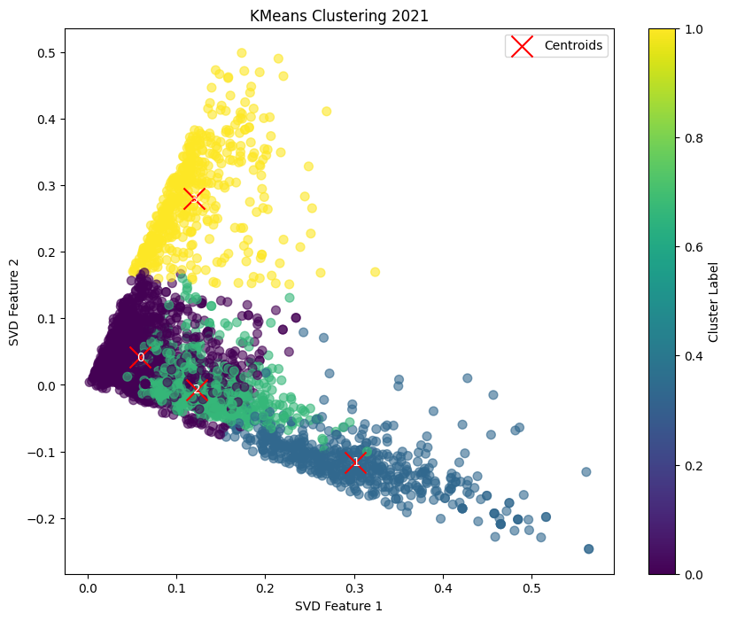
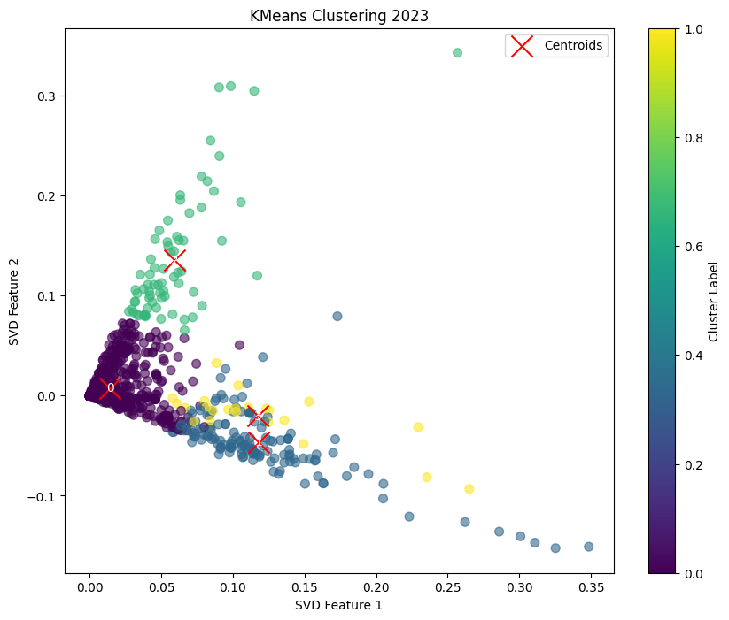
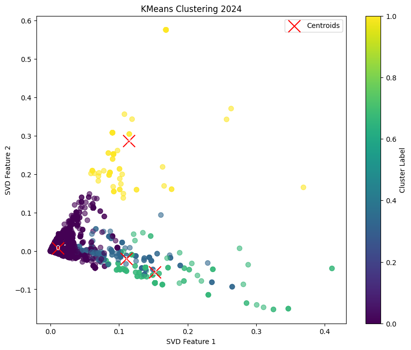
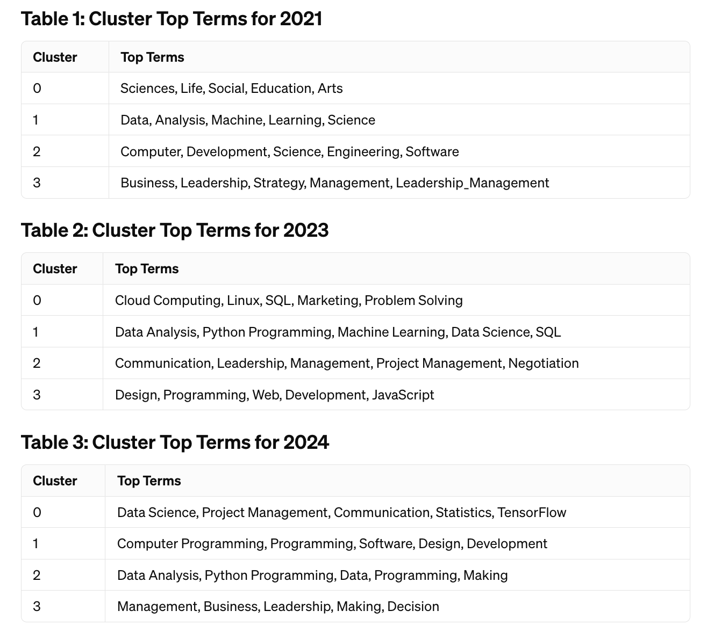
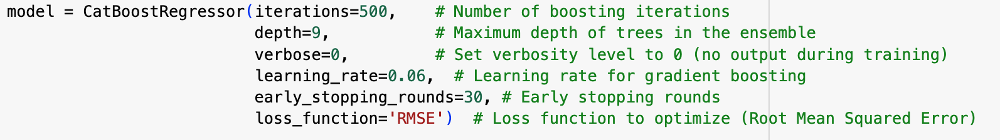
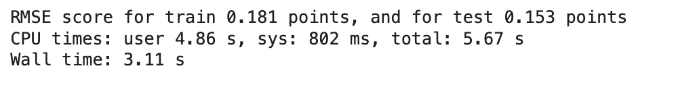
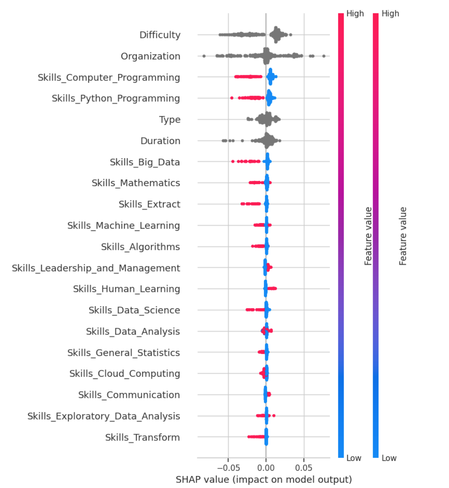
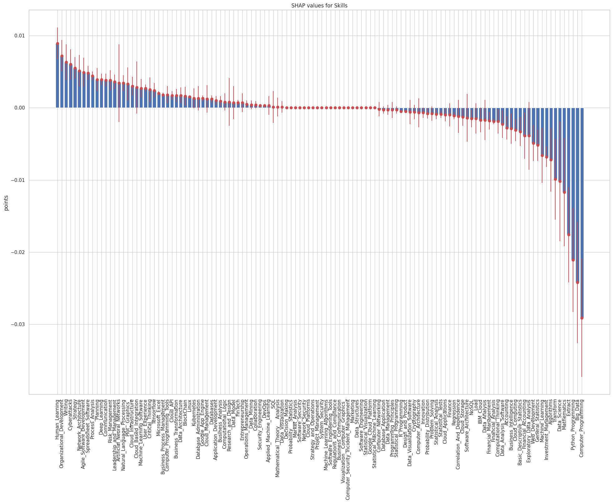
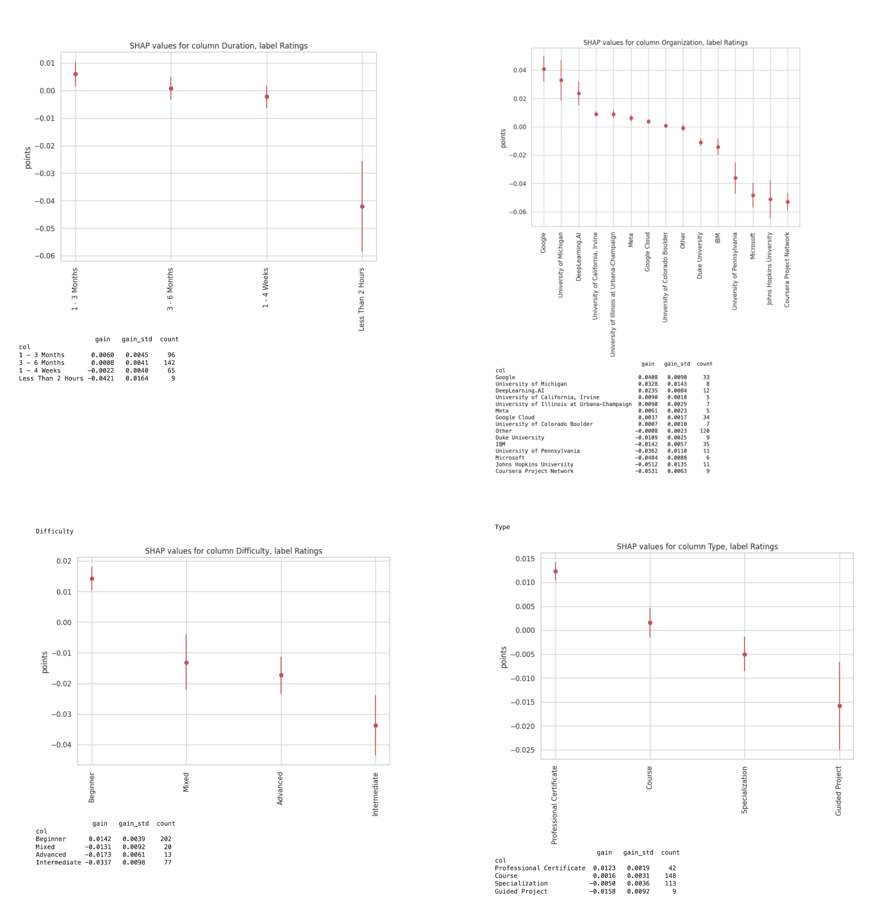

# DSCI 599 - Trends in Online Courses: A Data-Driven Analysis

## Introduction

- To identify and analyze evolving trends in the design of courses and how these influence learner engagement on Coursera over the period from 2021 to 2024. The study aims to help educators and platforms optimize content to meet changing learner needs effectively.
- Approach: Employing advanced machine learning techniques including Clustering Analysis and SHAP Analysis to analyze and predict key elements of successful course design.
- Application:a personalized course recommendation system using Python and Streamlit.

## Clustering Analysis of Coursera Course Skills
> Deciphering Educational Patterns

### Dataset and Data Preprocessing
- Data sourced from Kaggle for 2021, 2023, and 2024.
- Datasets include course descriptions, skills, and ratings from Coursera.

**Preprocessing: Text data tokenized, lemmatized, and cleansed of stopwords**

### Clustering model

- Employed TF-IDF vectorization for feature extraction from skills data.
- Used Truncated SVD to reduce dimensionality of TF-IDF vectors.
- Applied KMeans clustering; number of clusters determined by silhouette scores.

----

### Clustering Results & Evolution

- 2021: Moderate cluster separation (Silhouette score: 0.524). Courses varied across disciplines.
  
  
  

- 2023: Improved separation (Silhouette score: 0.618). Shift towards technical and professional skills.
  

- 2024: Distinct clustering (Silhouette score: 0.778). Focus on advanced technology and project management.

---

### Analysis & Trends

- Shift from broad academic topics like arts, social science to specialized technical skills reflects market demands.
- Leadership and management appears in all three year. Enduring focus on management and leadership alongside technical training.
- Online platforms rapidly adapting to technological advancements and job market needs. For instance, tensorflow become a popular skill.

---

## A SHAP Analysis of Coursera Ratings

> Understanding Online Course Trends

### Model Implementation and Performance
#### Model Selection

The CatBoostRegressor was chosen for its robust handling of categorical data and advanced gradient boosting capabilities. This model is particularly adept at processing complex data structures and delivering high-performance outcomes, making it suitable for our predictive analysis of course ratings.

#### Data Preparation and Split
The dataset was split into training and test sets with a 50% test size to ensure a robust evaluation of the model's performance. We used a random seed of 0 to maintain consistency in our data splits across different runs. Additionally, stratification was applied based on the selected column to ensure that both training and testing datasets are representative of the overall data distribution.

---

#### Training and Testing Data Pools
We utilized CatBoost's Pool class to manage our data:
- Training Data Pool: Created to efficiently handle categorical features and optimize the model's training process.
- Testing Data Pool: Set up similarly to evaluate the model's generalization capability on unseen data.

#### Model Training and Evaluation

The model's performance was rigorously evaluated using the Root Mean Square Error (RMSE) metric:
- Training RMSE: 0.181 points
- Test RMSE: 0.153 points

---

### SHAP Value Analysis and Visualization

#### SHAP Value Initialization
- TreeExplainer: A `TreeExplainer` object was created specifically for our CatBoostRegressor model, which is particularly suited for handling tree ensemble models.
- SHAP Values Calculation: SHAP values were calculated for the test data using the `TreeExplainer`. This process helps in quantifying the impact of each feature on the prediction output.
#### Visualization of SHAP Values
- Summary Plot Generation: We generated a summary plot to visualize the impact of various features on model predictions. This visualization helps in identifying the most influential features and their effects on the ratings. 

---

#### Key Insights from SHAP Analysis
- Technical Skills: The prominence of programming skills, especially in Python, is evident from the SHAP values, indicating a high demand for technically oriented courses. This underscores the alignment with real-world market demands for programming skills.
- Course Characteristics: Features such as `Duration` and `Type` show significant impacts, suggesting that the length and format of courses critically influence student preferences. Courses that match optimal duration and type are more likely to succeed, highlighting a trend towards flexible yet comprehensive learning formats.
- Practical Skills: The analysis reveals a strong emphasis on skills related to Data Analysis, Machine Learning, and Cloud Computing. These skills are highly valued in today's job market, indicating a trend towards courses that offer practical and immediately applicable knowledge.
- Soft Skills: Despite the dominance of technical skills, the significant presence of features like `Communication skills` and `Leadership and Management skills` demonstrates the importance of soft skills in professional development.

---

A bar chart with error bars was created to better visualize the SHAP values, illustrating the impact of various features on course ratings.

#### Insights from SHAP Value Bar Chart

- Technical Skills: Features such as `Skills_Python_Programming`, `Skills_Data_Analysis`, and `Skills_Machine_Learning` display long red bars, indicating a strong positive effect on course ratings. This suggests high demand for courses with technical skills, aligning with the trend of valuable career-advancing knowledge.
- Humanities-Related Skills: In contrast, `Skills_Communication` and `Skills_Leadership_and_Management` are represented with shorter bars, indicating a more modest impact on course ratings. These findings suggest a current preference among learners for more technical, marketable skills over humanities skills, despite the importance of a balanced skill set for professional development.

---

### SHAP Values Analysis for Specific Features

We visualized SHAP values for several key features: Duration, Organization, Difficulty, and Type.

#### Duration
- Short Courses (<2 hours): Often result in lower satisfaction and ratings, suggesting insufficient value.
- 1 to 3 Months: Align well with learner expectations, offering a balance of comprehensive learning in a manageable timeframe.

#### Organization
- High Impact: Google and University of Michigan show positive SHAP values, generally indicating higher ratings.
- Moderate Impact: Deep Learning.AI, University of California, Irvine, and University of Illinois at Urbana-Champaign have modest positive impacts.
- Negative Impact: IBM, University of Pennsylvania, and Microsoft exhibit negative SHAP values, potentially lowering ratings.

---

### Conclusion from Two Perspectives
#### Learner Preferences
- Preferred Courses: Beginner-level, professionally certified courses lasting one to three months are highly favored.
- Avoided Courses: There is a notable aversion to brief or overly demanding courses, such as guided projects or advanced courses.
#### Strategy for Course Offerings
- Alignment with Preferences: Develop and promote courses that match learner preferences for accessibility and practical skills.
- Improvements: Enhance support structures and tailor content to improve satisfaction and ratings, particularly for courses receiving negative feedback.

---

## Course Recommendation System for Coursera

> Leveraging Cluster Analysis and SHAP for Enhanced Online Learning

### Course Recommendation System - Concept

#### Goal
Improve user experience through personalized course suggestions.

#### Features
Inputs for skills, course format, and difficulty.
Personalized recommendations based on user preferences and data-driven insights.

#### Data Preparation
Use of "coursera_course_2024.csv" with comprehensive course details.

#### Keyword Matching
Employing GPT-3.5-turbo for effective input analysis.

#### Course Filtering
Dynamic query generation for tailored recommendations.

#### User Interface
Streamlit-based, easy-to-navigate application design.

---

### Challenges, Solutions and Future Enhancements

#### Challenges
- Complex keyword and metadata matching.
- Balancing relevance and diversity in course recommendations.

#### Solutions
- Utilized NLP for improved keyword extraction and semantic matching.
- Adjusted algorithm parameters to blend popular and niche offerings.

#### Future Enhancements
- **Data Needs**: More comprehensive user preference data to enable collaborative filtering.
- **Recommendation Improvements**: Prioritize content aligned with detected trends for future recommendations.
- **Objective**: Optimize user experience and expand user base.

---

## Conclusions

#### Insights from Analysis

Significant trends in course characteristics and learner preferences detected.

#### Strategic Implications for Coursera:
Development focus on beginner and professionally certified courses.
Adjustment of course support and content to align with learner needs.

#### Impact
Enhanced personalization and strategic course planning.

